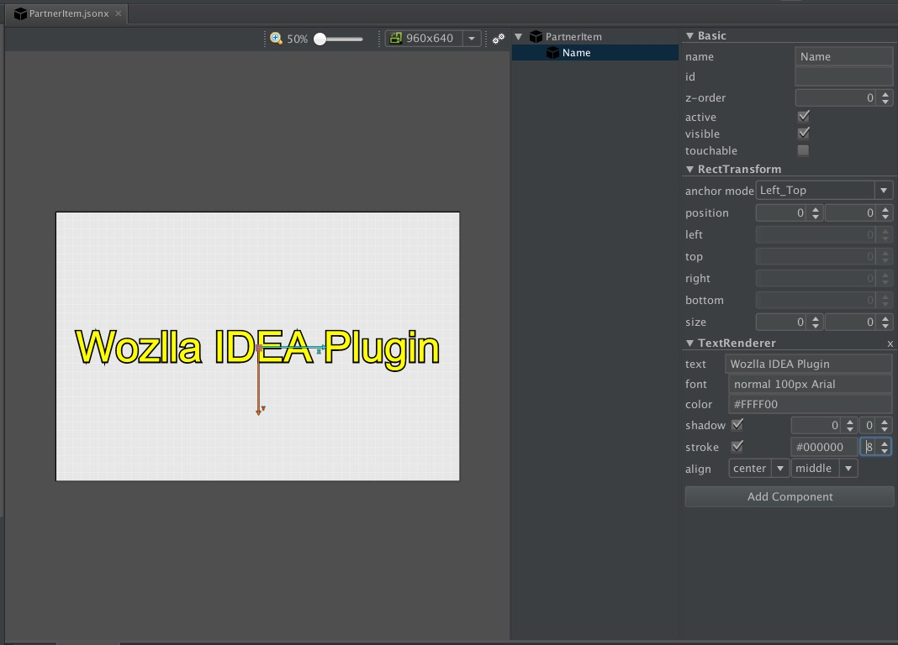

# WozllaIDEAPlugin (Developing)
Wozlla IDEA Plugin enhanced visual editing for WOZLLA.js

## TODOs

* Partial change contents of SceneEditor document, when scene was changed.
* Visual Editor: visual editing,
* More fields of Inspector.
* Auto compile changes and reload Visual Editor

## Changes

* VisualEditor: resolution, zooming
